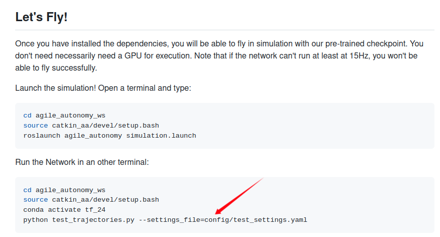
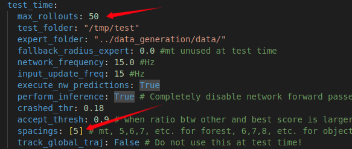
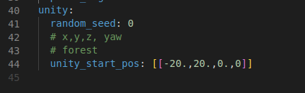

# 深入分析agile_autonomy项目给的仿真测试



[在项目介绍页](https://github.com/uzh-rpg/agile_autonomy/)，得知在另一个terminal中运行此命令：会启动飞机进行避障飞行

```bash
python test_trajectories.py --settings_file=config/test_settings.yaml
```

在[源码裁剪](./源码裁剪.md)中，分析了该命令运行后主要启动一个函数：*trainer.perform_testing()*	，分析知该函数与飞机进行避障飞行有关，

现在对该函数深入分析。


### 4.24 分析test_trajectories.py

```python
def main():
    parser = argparse.ArgumentParser(description='Evaluate Trajectory tracker.')
    parser.add_argument('--settings_file', help='Path to settings yaml', required=True)

    args = parser.parse_args()
    settings_filepath = args.settings_file
    settings = create_settings(settings_filepath, mode='test')
    trainer = Trainer(settings)
    trainer.perform_testing()
```

该文件加载 *test_settings.yaml* 并创建了 *Trainer* 类实例，执行该类的 *perform_testing()* 方法。

在 *dagger_training.py* 中，

```py
    def __init__(self, settings):
        rospy.init_node('iterative_learning_node', anonymous=False)
        self.settings = settings
        np.random.seed(self.settings.random_seed)
        self.expert_done = False
        self.label_sub = rospy.Subscriber("/hummingbird/labelling_completed", Bool,
                                          self.callback_expert, queue_size=1)  # Expert is done, decide what to do.
        self.msg_handler = MessageHandler()
```

（可以看出以 *Trainer* 创建实例时会创建一个 ***'iterative_learning_node'*** 节点）


####  *perform_testing()* 

```py
    def perform_testing(self):
        self.learner = PlannerLearning.PlanLearning(
            self.settings, mode="testing")
        tree_spacings = self.settings.tree_spacings
        removable_rollout_folders = os.listdir(self.settings.expert_folder)
        if len(removable_rollout_folders) > 0:
            removable_rollout_folders = [os.path.join(self.settings.expert_folder, d) \
                                         for d in removable_rollout_folders]
            removable_rollout_folders = [d for d in removable_rollout_folders if os.path.isdir(d)]
            for d in removable_rollout_folders:
                string = "rm -rf {}".format(d)
                os.system(string)
```

该函数**首先**初始化了一个 *PlanLearning* 对象实例，**然后**从settings对象属性里获取了一些值，**删除**了一些文件 *removable_rollout_folders*

**最后开始循环**。

```python
for spacing in tree_spacings:
    ~
```

从以上分析总结四点下一步要进行的工作：

- 分析 **PlanLearning**
- 了解 **settings对象**
- 为什么删除 **removable_rollout_folders**
- 循环体做了什么事


### 4.25 分析test_trajectories.py

*perform_testing()* 函数中的 **settings对象** 即此命令中加载的 **test_settings.yaml** 文件，

```bash
python test_trajectories.py --settings_file=config/test_settings.yaml
```

 **settings对象** 定义在 *config/* 目录下的 **settings.py** 中，

```py
        for spacing in tree_spacings:
            self.msg_handler.publish_tree_spacing(spacing)
            self.msg_handler.publish_obj_spacing(spacing)
            exp_log_dir = os.path.join(self.settings.log_dir, "tree_{}_obj_{}".format(spacing,spacing))
            os.makedirs(exp_log_dir)
            # Start Experiment
            rollout_idx = 0
            report_buffer = []
            while rollout_idx < self.settings.max_rollouts:
                self.learner.maneuver_complete = False  # Just to be sure
                unity_start_pos = setup_sim(self.msg_handler, config=self.settings)
                self.start_experiment(rollout_idx)
                output_file_buffer = os.path.join(exp_log_dir,
                                                "experiment_metrics.json")
                start = time.time()
                exp_failed = False
                self.expert_done = False  # Re-init to be sure
```



由配置文件可知，for循环只执行了一遍，发布消息生成对应数量的树和物体

```py
self.msg_handler.publish_tree_spacing(spacing)
self.msg_handler.publish_obj_spacing(spacing)
```

### 4.26 分析test_trajectories.py

```py
    parser = argparse.ArgumentParser(description='Evaluate Trajectory tracker.')
    parser.add_argument('--settings_file', help='Path to settings yaml', required=True)
```

​		从 **argparse** 模块中创建一个 **ArgumentParser** 类实例，用于从别的文件中加载参数。然后创建一个命令行参数解析器，以 *'--settings_file'* 指定要加载文件的路径，*required=True* 即必须指定外部参数文件，否则脚本无法运行。

```py
args = parser.parse_args()
settings_filepath = args.settings_file
settings = create_settings(settings_filepath, mode='test')
```

​		解析命令行参数，返回命令行传入的文件路径，然后创建 **settings** 对象，其中 **create_settings** 函数如下：

```py
def create_settings(settings_yaml, mode='test'):
    setting_dict = {'train': TrainSetting,
                    'openloop': OpenLoopSetting,
                    'test': TestSetting,
                    'dagger': DaggerSetting}
    settings = setting_dict.get(mode, None)
    if settings is None:
        raise IOError("Unidentified Settings")
    settings = settings(settings_yaml)
    if mode == 'test' or mode == 'openloop':
        settings.freeze_backbone = True
    return settings
```

根据传入的参数可知：**settings** 是 **TestSetting** 类的一个实例（**TestSetting** 类定义在 *config/* 目录下的 **settings.py** 中）**settings** 包含了 *test_settings.yaml* 中所有的参数。

到这里 **test_trajectories.py** 分析结束，它的作用即：

- 解析命令行 ，获取用户给定的参数配置 *test_settings.yaml* ，加载到 **settings** 中

  ```py
  python test_trajectories.py --settings_file=config/test_settings.yaml
  ```

- 创建 **Trainer** 对象（定义在**dagger_training.py**中），并用  **settings** 进行初始化
- 执行任务：**trainer.perform_testing()**

#### 分析 perform_testing()

```py
unity_start_pos = setup_sim(self.msg_handler, config=self.settings)
```

该函数循环体中此句似乎触及到了该仿真的核心，

```py
def setup_sim(msg_handler, config):
    print("==========================")
    print("     RESET SIMULATION     ")
    print("==========================")

    # after this message, autopilot will automatically go to 'BREAKING' and 'HOVER' state since
    # no control_command_inputs are published any more
    os.system("rosservice call /gazebo/pause_physics")
    print("Unpausing Physics...")
    os.system("rosservice call /gazebo/unpause_physics")
    print("Placing quadrotor...")
    msg_handler.publish_autopilot_off()
    # get a position
    pos_choice = np.random.choice(len(config.unity_start_pos))
    position = np.array(config.unity_start_pos[pos_choice])
    # No yawing possible for trajectory generation
    start_quaternion = Quaternion(axis=[0,0,1], angle=position[-1]).elements

    start_string = "rosservice call /gazebo/set_model_state " + \
     "'{model_state: { model_name: hummingbird, pose: { position: { x: %f, y: %f ,z: %f }, " % (position[0],position[1],position[2]) + \
     "orientation: {x: %f, y: %f, z: %f, w: %f}}, " % (start_quaternion[1],start_quaternion[2],start_quaternion[3],start_quaternion[0]) + \
     "twist:{ linear: {x: 0.0 , y: 0 ,z: 0 } , angular: { x: 0.0 , y: 0 , z: 0.0 }}, " + \
     "reference_frame: world } }'"

    os.system(start_string)
    return position
```



该函数为仿真执行了复位，从配置参数中随机选择一个位姿作为仿真环境下飞机的初始位姿

### 4.27 分析 perform_testing()

仿真测试，分析仿真开始执行时的系统情况

