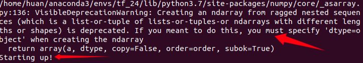
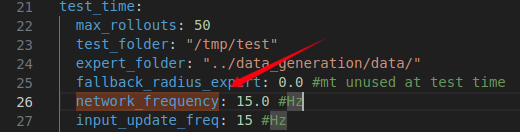
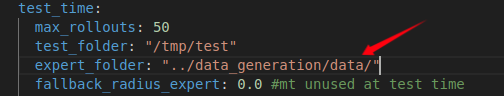

# 4.29_分析PlannerBase.py与PlannerLearning.py

仿真测试发现，*perform_testing()* 启动飞行后，程序调用了 **PlannerBase.py与PlannerLearning.py** 内的 *callback_fly()* 函数，

其主要功能为加载参考追踪文件，启动tensorflow，以及一些其它操作，这部分程序与飞机避障飞行密切相关，需要进一步深入

分析。

下一步工作：

- 分析 **PlannerBase.py** 里的  *callback_fly()* 
- 分析 **PlannerLearning.py** 里的  *callback_fly()* 
- 搞清楚以上两个函数是何时，被怎样调用的

### 5.3 

可以确定的是

```py
                unity_start_pos = setup_sim(self.msg_handler, config=self.settings)
                self.start_experiment(rollout_idx)
```

这两句分别复位与开始飞行仿真环境里的飞机，但却找不到上次进展中提到的  *callback_fly()* 是如何被调用的，不少发布的话题在工程中找不到订阅，使得当前进展停滞，解决这个问题。

***PlannerBase.py*** 中：

```py
        self.fly_sub = rospy.Subscriber("/" + self.quad_name + "/agile_autonomy/start_flying", Bool,
                                        self.callback_fly, queue_size=1)  # Receive and fly
```

### 5.4

寻着该订阅的调用路径，最终找到了其执行源头：

```py
    def perform_testing(self):
        self.learner = PlannerLearning.PlanLearning(
```

在 *perform_testing()* 函数的第一句创建了 **PlanLearning** 对象，在该对象的构造函数中，有如下代码：

```py
        # Check at 20Hz the collision
        self.timer_check = rospy.Timer(
            rospy.Duration(1. / 20.),
            self.check_task_progress)
```

*self.check_task_progress* 函数以20Hz被定时回调，在函数中会不断检查当前系统的状态，当 *perform_testing()* 把系统初始化好后，仿真飞行就开始进行。

其中就包含 **PlannerLearning.py** 里该话题的发布：

```py
        self.data_pub = rospy.Publisher("/hummingbird/agile_autonomy/start_flying", Bool,
                                        queue_size=1) 
```

其被 **PlannerBase.py** 订阅，执行回调 *callback_fly*，加载仿真配置：

```py
        self.fly_sub = rospy.Subscriber("/" + self.quad_name + "/agile_autonomy/start_flying", Bool,
                                        self.callback_fly, queue_size=1) 
```

### 5.5

针对  *callback_fly* 查阅相关资料，

```py
        self.learner = PlannerLearning.PlanLearning(
            self.settings, mode="testing")
```

弄清其是如何被执行的， *callback_fly* 被调用了两个不同的版本，目前尚不清楚调用机制

### 5.6

补充**Python，C++** 关于类与派生的知识，解决了遗留问题：

*callback_fly*  能够被调用两个不同的版本（一个是在派生类中，一个在父类中）源于：

**PlanLearning** 类构造函数中的

```py
super(PlanLearning, self).__init__(config, mode)
```

```py
class PlanLearning(PlanBase):
```


**PlanLearning** 在自己的构造函数中继承了 **PlanBase** 的构造函数，使得该订阅执行了两次

```py
        self.fly_sub = rospy.Subscriber("/" + self.quad_name + "/agile_autonomy/start_flying", Bool,
                                        self.callback_fly, queue_size=1)  # Receive and fly
```

虽然代码只出现了一次，但根据程序执行时 **self** 代表对象的不同，其实创建了两个不同的订阅，分别执行  **PlanBase** 与 **PlanLearning** 下的*callback_fly*  。

### 5.8

**PlannerLearning.py** 的 callback_fly 中读取点云，生成树，加载参考飞行轨迹，但尚不清除最终是如何启动飞机开始飞行，

在该文件中存在一个函数，似乎是以回调的形式被外部调用的，在飞机飞行期间持续广播 ***"Starting up!"***，指示飞机正在运行：

```py
    def evaluate_dagger_condition(self):
        if self.reference_progress < 50:
            # At the beginning always use expert (otherwise gives gazebo problems)
            print("Starting up!")
            return False
```



目前仅剩这两条终端info没有搞清楚其机制

##### 下一步工作：

- 修改参考轨迹，尝试控制飞机以不同路径飞行
- 解决遗留问题

### 5.9

经更改程序仿真测试，解决了昨天遗留的问题：
**PlannerLearning.py** 中 **PlanLearning** 类重写了其父类 **PlanBase** 的方法：*evaluate_dagger_condition* ，而创建 **PlanLearning** 对象时，在父类中会创建一个定时器，定时回调 *evaluate_dagger_condition* ，而回调的频率则在 **test_settings.yaml** 文件中有定义：



### 5.10

```py
    def callback_fly(self, data):
        # If self.use_network is true, then trajectory is already loaded
        if data.data and (not self.use_network):
            # Load pointcloud and make kdtree out of it
            rollout_dir = os.path.join(self.config.expert_folder,
                                       sorted(os.listdir(self.config.expert_folder))[-1])
```

遇到新问题：仿真开始前加载的文件夹 rollout_dir 找不到，在工程目录中它是空的，



但通过测试，发现在程序中，路径是正确加载的，暂时不清楚原理，下一步解决这个问题。

### 5.11

仿真运行中该文件夹下有数据，运行结束，给文件夹数据被自动清空，运行时，数据文件自动创建，可以断定的是在某处有程序做了这件事，目前还不清楚是在哪一块。问题待续。


明天继续分析仿真执行流程
